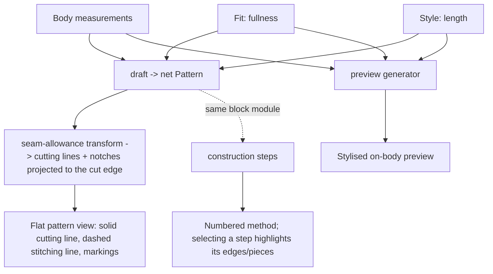

# Cut on the Fold — Architecture & Onboarding

*How this codebase is shaped, and why. It works two ways: an on-ramp for someone seeing it for the first time, and a reference to re-anchor on how the pieces fit when the lower-level detail has faded — useful whether you're reading in fresh or coming back to remind yourself of the shape. Read it before changing anything structural; it'll save you from fighting the grain of the design.*

---

## What this is

Cut on the Fold turns a person's body measurements, plus a few fit and style choices, into a printable paper sewing pattern — the kind you'd pin to fabric and cut around. It's built one garment "block" at a time, slowly, as a long-horizon project.

The pattern maths is real, drawn from Winifred Aldrich's *Metric Pattern Cutting for Women's Wear*. The app's job is to compute those drafts from measurements and render them as something you can print, preview, and sew.

**Stack:** Next.js (App Router) + TypeScript, SVG for all drawing, PDF output planned.

---

## A little sewing vocabulary

You don't need to sew to work on this, but you need a handful of words:

- **Block** — a basic pattern for one garment type (e.g. a skirt), from which variations are made. In code, one block = one draft function.
- **Pattern piece** — a single shape you cut from fabric (a skirt panel, a waistband).
- **Stitching line vs cutting line** — you sew along the stitching line; you cut along the cutting line, which sits a little outside it. The gap between them is the **seam allowance**, so the fabric doesn't fray away at the seam. The **hem allowance** is a deeper version at the bottom edge.
- **Cut on the fold** — a piece laid against a fold in the fabric so it comes out symmetrical and double-width; that folded edge gets *no* seam allowance.
- **Notch** — a small mark on the cutting edge used to line two pieces up when sewing.
- **Grainline** — an arrow showing how to align the piece with the weave of the fabric.
- **Gather** — bunching a long edge up small to fit a shorter one (how a gathered skirt gets its fullness).

(The project is named after that "cut on the fold" instruction.)

---

## The big ideas

These are the load-bearing decisions. Most of the code makes sense once you hold them in mind.

**One unit: millimetres.** Every length in the domain is in millimetres. Conversion to/from centimetres or inches happens *only* at the UI boundary. Inside the model there is never any ambiguity about units.

**The domain layer is pure.** The drafting code is plain functions from inputs to data — no React, no rendering, no I/O. You can reason about and test it in isolation. Rendering is a separate concern downstream.

**Pattern maths is never invented.** The geometry of a draft comes from Aldrich (or whoever owns the pattern knowledge), verified against the book and against sewn test garments. We do not guess or "improve" the maths. If a number isn't sourced, it doesn't go in. This is the one rule to be most careful about.

**A block has three faces.** From the same inputs, a block produces three independent outputs, each with its own generator:

1. the **pieces** — the flat-pattern geometry (a `Pattern`),
2. the **preview** — a stylised picture of the garment,
3. the **method** — the ordered construction steps.

These are not derived from each other; they're three views of the same garment, kept separate so each can evolve on its own.

**Inputs are layered.** Body measurements (waist, hip, …) describe the *person*. **Fit** (ease, fullness) is the deliberate bridge from body to garment — it's where "how loose / how full" lives. **Style** is design choice (length, waistband depth). The draft combines them to derive the actual garment measurements. Keeping these three separate is what lets one body drive many different garments.

**Seam allowance is a derived layer, not part of the draft.** The draft produces the *net* (stitching) line — the finished shape. A separate, shared transform offsets each edge outward to produce the *cutting* line. This keeps the Aldrich maths clean and makes allowance a tunable policy rather than something baked into every block.

**Edges carry meaning and identity.** A piece outline isn't a bare list of points; each edge knows its **type** (`seam` / `fold` / `hem`, which drives how much allowance it gets) and optionally a **role** (an opaque label like `"side-seam"` or `"waist"`, used to point at a specific edge — for instance to highlight it when its construction step is selected). Type is owned by the geometry layer; role by the UI/step layer. They're orthogonal on purpose.

**Parameters vs features.** A variation is either a **parameter** (a number, like length or fullness) or a **feature** (an added piece, like a pocket, which brings its own geometry *and* its own construction step). This split keeps "tweak a dial" cleanly distinct from "add a thing."

**Don't build abstractions before they're needed.** Several places are deliberately simple (e.g. construction steps are a flat list, because no feature yet needs to assemble them). Add structure when a real case demands it, not in anticipation.

---

## How a block flows, end to end

Here's the whole loop, using the gathered skirt — the first block, built to prove the architecture:



In words: the inputs feed the **draft**, which produces a `Pattern` of pieces drawn to the *net* line, each edge tagged by type and role, each piece carrying its markings (grainline, notches, fold, gather, …). That net pattern passes through the shared **seam-allowance transform**, which grows each edge outward by its allowance (seams ~15 mm, hem deeper, fold none), reconnects the corners, and slides the notches out onto the new cutting edge. The flat-pattern view then draws the solid cutting line, the dashed stitching line just inside it, and the markings.

Separately, a **preview generator** draws a stylised picture from the same inputs, and the block's **construction steps** render as a numbered method; selecting a step highlights the edges/pieces it names — which is *why* edges carry roles.

---

## Data model at a glance

The core types, and what each holds:

- `Millimetres`, `Point`, `Line` — the primitives. Everything geometric is built from these, all in millimetres.
- `BodyMeasurements` — the person: waist, hip, hip depth. Shared across garments.
- *Fit* and *Style* types, one set per garment — e.g. `GatheredSkirtFit` (a fullness allowance) and `GatheredSkirtStyle` (length). Fit is the bridge from body to garment; style is design choice.
- `EdgeType` — `"seam" | "fold" | "hem"`. Drives how much seam allowance an edge gets. Owned by the geometry layer.
- `OutlinePoint` — a point on a piece outline: its position (`at`), the `edge` type of the segment *leaving* it, and an optional `role` (an opaque identity label such as `"side-seam"`, used for reference and highlighting). A piece outline is a closed ring of these.
- `Marking` — a discriminated union of everything drawn on a piece besides its outline: grainline, fold line, construction line, place-on-fold bracket, gather, notch, button, buttonhole. Each variant is drawn in exactly one place in the renderer.
- `PatternPiece` — one cuttable shape: its `name`, how many to cut, whether it's on the fold, its `outline` (the net/stitching ring of `OutlinePoint`s), an optional derived `cuttingOutline` (added by the seam-allowance transform), and its `markings`.
- `Pattern` — the flat-pattern output: a set of `PatternPiece`s. Purely geometric; nothing else lives here.
- `SeamAllowancePolicy` — the allowance amounts (seam, hem) the transform applies. Kept apart from the edges, so edges carry *meaning* and the policy carries *millimetres*.
- `ConstructionStep` — one step of the method: an `id`, human-readable `text`, and an optional `highlight` (a list of `StepHighlight` `{ piece, edges? }` targets that say what to light up when the step is selected).

---

## Project layout

```
cutonthefold/
├── AGENTS.md                      # terse architecture rules for AI coding agents
├── CLAUDE.md                      # pointer to AGENTS.md
├── app/                           # Next.js UI (App Router)
│   ├── layout.tsx                 # root layout, fonts
│   ├── page.tsx                   # home: form, flat pattern SVG, preview, method list,
│   │                              # step highlighting, optional 5 cm grid, UI skin toggle
│   ├── page.module.css            # page styling (Warm + Studio skins, pattern line-art colours)
│   ├── globals.css                # base styles
│   ├── favicon.ico
│   └── NumericInput.tsx           # numeric measurement fields (text input, leading-zero UX)
├── lib/                           # domain layer — pure TypeScript, no React
│   ├── types/
│   │   ├── measurements.ts        # geometry types, Pattern, ConstructionStep, StepHighlight,
│   │   │                          # body/fit/style types, form metadata
│   │   └── validation.ts          # ValidationResult, validationResult()
│   ├── patterns/
│   │   ├── gatheredSkirt.ts       # gathered skirt: draft, validate, instructions
│   │   └── straightWaistband.ts   # shared waistband piece, composed by blocks
│   ├── previews/
│   │   └── gatheredSkirt.ts       # stylised on-figure preview generator
│   ├── geometry/
│   │   └── seamAllowance.ts       # net → cutting transform; notch projection
│   └── patternHighlight.ts        # resolve step highlights → edge runs (used by page renderer)
├── docs/
│   ├── ARCHITECTURE.md            # architecture doc (earlier revision)
│   ├── ARCHITECTURE_1.md          # working draft
│   └── ARCHITECTURE_3.md          # this file
├── public/                        # static assets (icons)
├── next.config.ts
├── tsconfig.json
├── package.json
└── README.md
```

In prose:

- **`lib/types/`** — the shared data model listed above. `measurements.ts` holds geometry and pattern types; `validation.ts` holds validation result types.
- **`lib/patterns/`** — one module per block (e.g. `gatheredSkirt.ts`) holding its draft, validation, and construction steps, plus shared construction such as `straightWaistband.ts`.
- **`lib/previews/`** — stylised preview generator(s), one module per block that has a preview.
- **`lib/geometry/`** — shared, garment-independent geometry, including the seam-allowance transform.
- **`lib/patternHighlight.ts`** — helpers that turn a step's `highlight` targets into edge runs on the cutting outline (consumed by the page renderer, not by the draft).
- **`app/`** — the Next.js UI: input form, flat-pattern SVG renderer (line art on a paper sheet), stylised preview, method list with step selection, optional 5 cm reference grid, and a Warm/Studio skin toggle for comparison.
- **`AGENTS.md`** — the terse architecture rules for AI coding agents. **This document is its human-facing companion**; keep the two consistent.

### Current blocks

| Block | Draft | Preview | Instructions | Shared pieces |
|-------|-------|---------|--------------|---------------|
| Gathered skirt | `draftGatheredSkirt` | `previewGatheredSkirt` | `gatheredSkirtInstructions` | `draftStraightWaistband` |

---

## Conventions

- Import with the `@/` path alias rather than long relative paths.
- All domain lengths in millimetres.
- Outline points are emitted in a consistent winding order (clockwise) so "outward" is well-defined for the seam-allowance offset.
- Markings are a single standardised set (a discriminated union); each symbol is drawn in exactly one place in the renderer.
- The flat pattern is drawn as **line art on a white sheet** — it should look like what comes off the printer (dark cutting line, dashed stitching line, no decorative fills). An optional 5 cm background grid can be toggled on as a scale reference while testing.

**A note on workflow.** This project is built with an architect-in-chat / implementer-in-editor split: design and pattern maths are worked out in conversation, and an AI coding agent makes the edits, runs the dev server, and fixes its own errors. Briefs tend to be precise specs rather than vague asks.

---

## Adding a new block

This is here to show how the architecture *extends* — understanding it is useful even if you never write a block yourself. Once the ideas above are in your head, the shape of the work is:

1. Define the block's **Fit** and **Style** types — the dials it exposes.
2. Write the **draft**: a pure function `(body, fit, style) → Pattern`, producing pieces drawn to the **net** line, edges tagged with `type` and `role`, points in clockwise order, markings attached. Reuse shared construction (e.g. the waistband) rather than re-drafting it. **Get the maths from the source — don't invent it.**
3. It flows through the seam-allowance transform for free.
4. Write the block's **preview** generator and its **construction steps**.
5. Wire it into the page.

If a variation is just a number, it's a parameter on Fit/Style. If it adds a piece, it's a feature — give it both its geometry and its step.

---

## Getting your bearings, and helping test

If you're coming to this to learn it and to test it alongside the person who designed it, here's the most useful path in:

- **Read one block end to end.** Start with the gathered skirt: follow its inputs into the draft, the draft's net `Pattern` through the seam-allowance transform, and out to the three views. Once one block makes sense, they all do — they share the same shape.
- **Run it and poke it.** Try awkward measurements and extreme fit values; turn the 5 cm grid on and check the geometry against it and against the underlying maths; watch for pieces that don't line up, notches in the wrong place, a cutting line that doesn't fully enclose the stitching line. A lot of the testing here is simply *does the output match what the pattern maths says it should* — concrete and checkable.
- **Treat the maths as sacred.** When something looks wrong, the bug is almost always in the plumbing, not the pattern maths (which is sourced and verified). Trace the code path before suspecting the numbers.

What you can fairly take from it: hands-on testing of a real TypeScript / Next.js / SVG application; the ability to explain a clean, layered architecture and *why* it's built that way; and exposure to a spec-driven, AI-assisted development workflow. All true, all worth saying.

---

## Status & roadmap

This is the project's planned direction, owned by its designer.

**Done** — the gathered-skirt testbed, which exists to *prove the architecture* rather than to be a beloved garment: the data model, the body → fit → garment input layering, the seam-allowance transform with notches projected to the cutting edge, the flat-pattern renderer, the stylised preview, the construction method with click-to-highlight, and an optional 5 cm testing grid.

**Next** — the straight skirt block; PDF / print output (where the real printed scale test square belongs); the avatar preview. Longer term: more blocks, and possibly a print-partner service for large-format output.

---

## The spirit of it

Built slowly, for the pleasure and the learning, over a long horizon. Clean separation of concerns over cleverness. Understand the code rather than cargo-culting it. Verify the pattern maths against the book and against real sewn garments. And don't over-engineer — let the design earn each piece of complexity.
